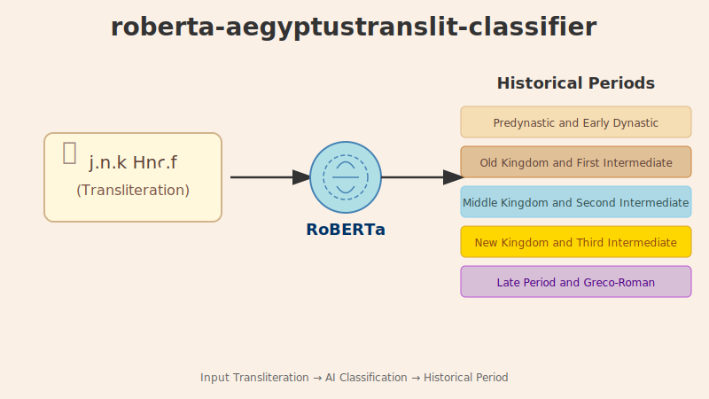

# roberta-aegyptustranslit-classifier

[](https://freepalestine.dev)


A fine-tuned `RoBERTa-base` model for classifying **Ancient Egyptian transliterations** into their respective historical **time periods** ('Predynastic & Early Dynastic', 'Old Kingdom & First Intermediate', 'Middle Kingdom & Second Intermediate', 'New Kingdom & Third Intermediate', 'Late Period & Greco-Roman Egypt').

View and use the model on HuggingFace via: https://huggingface.co/RamzyBakir/roberta-aegyptustranslit-classifier



## Model Details

- **Base model**: `roberta-base`
- **Task**: Text classification
- **Classes**: 5 historical time periods
- **Fine-tuned on**: Custom labeled dataset (transliteration, period)

## Training Results

| Metric | Value |
|--------|-------|
| **F1 Score** | ~0.562 |
| **Weighted F1** | ~0.567 |
| **Validation Loss** | ~1.5295 |
| **Epochs** | 20 |
| **Learning Rate** | 2e-5 |
| **Batch Size** | 64 |

## Per-class F1 scores:
- **Predynastic & Early Dynastic:** F1 = 0.576
- **Old Kingdom & First Intermediate:** F1 = 0.432
- **Middle Kingdom & Second Intermediate:** F1 = 0.468
- **New Kingdom & Third Intermediate:** F1 = 0.713
- **Late Period & Greco-Roman Egypt:** F1 = 0.608

## Intended Use & Limitations

This model is designed for **historical text classification** and intended for exploratory research and as a performance baseline. 
Current constraints include:  
- **Data limitations**: ~10k balanced samples may not represent all orthographic variations.  
- **Period bias**: Middle Kingdom classification (F1=0.47) underperforms due to:  
  - Orthographic overlap with neighboring periods  
- **Best practices**: Always verify critical classifications with primary sources.  

**Roadmap**:  
- v2.0: Expand to ccorpus samples (balanced & unbalanced)

## Data Used For Training

Thesaurus Linguae Aegyptiae, Late Egyptian sentences, corpus v19, premium, https://huggingface.co/datasets/thesaurus-linguae-aegyptiae/tla-late_egyptian-v19-premium, v1.0, 1/19/2025 ed. by Tonio Sebastian Richter & Daniel A. Werning on behalf of the Berlin-Brandenburgische Akademie der Wissenschaften and Hans-Werner Fischer-Elfert & Peter Dils on behalf of the Sächsische Akademie der Wissenschaften zu Leipzig.
Thesaurus Linguae Aegyptiae, Original Earlier Egyptian sentences, corpus v18, premium, https://huggingface.co/datasets/thesaurus-linguae-aegyptiae/tla-Earlier_Egyptian_original-v18-premium, v1.1, 2/16/2024 ed. by Tonio Sebastian Richter & Daniel A. Werning on behalf of the Berlin-Brandenburgische Akademie der Wissenschaften and Hans-Werner Fischer-Elfert & Peter Dils on behalf of the Sächsische Akademie der Wissenschaften zu Leipzig.
Thesaurus Linguae Aegyptiae, Demotic sentences, corpus v18, premium https://huggingface.co/datasets/thesaurus-linguae-aegyptiae/tla-demotic-v18-premium, v1.1, 2/16/2024 ed. by Tonio Sebastian Richter & Daniel A. Werning on behalf of the Berlin-Brandenburgische Akademie der Wissenschaften and Hans-Werner Fischer-Elfert & Peter Dils on behalf of the Sächsische Akademie der Wissenschaften zu Leipzig.

## Usage

```python
# Using pipline
from transformers import pipeline

classifier = pipeline("text-classification", model="RamzyBakir/roberta-aegyptustranslit-classifier")
classifier("bn-ꞽw n rmṯ-ḫm ꞽn ꜥn pꜣ nty ḫꜣꜥ pꜣ myṱ r-ḏbꜣ swg")

# Load model directly
from transformers import AutoTokenizer, AutoModelForSequenceClassification

model = AutoModelForSequenceClassification.from_pretrained("RamzyBakir/roberta-aegyptustranslit-classifier")
tokenizer = AutoTokenizer.from_pretrained("RamzyBakir/roberta-aegyptustranslit-classifier")
